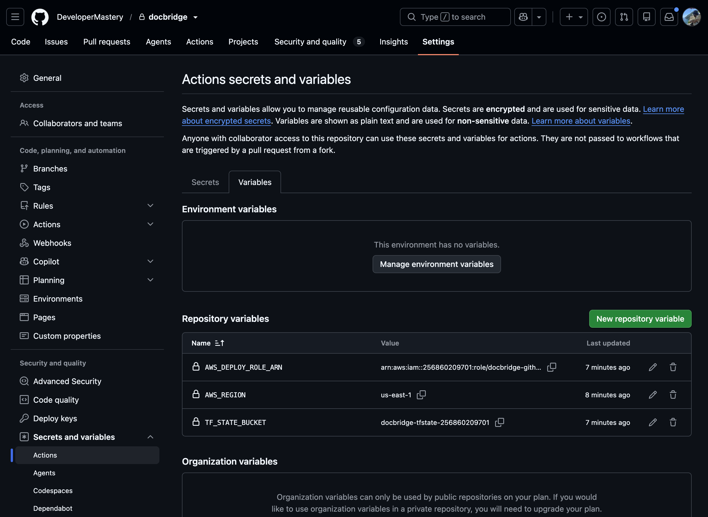
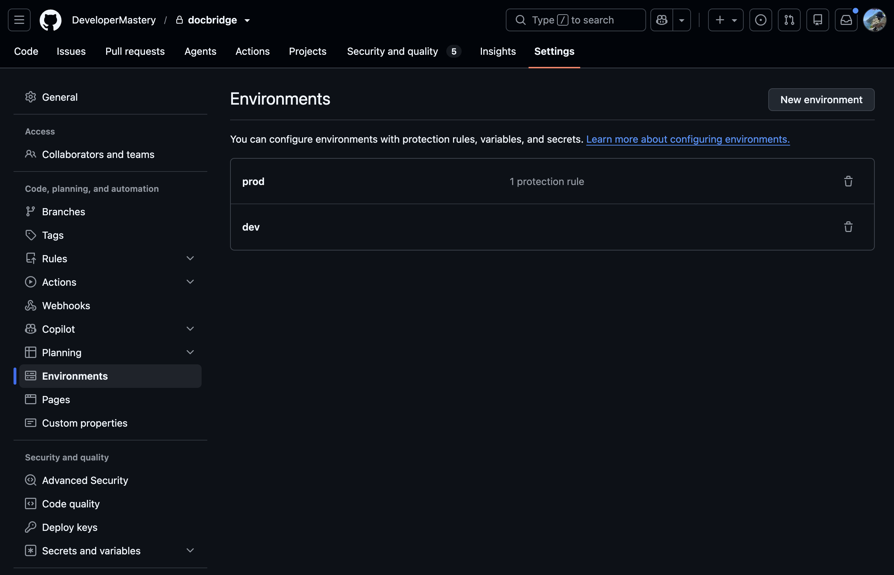
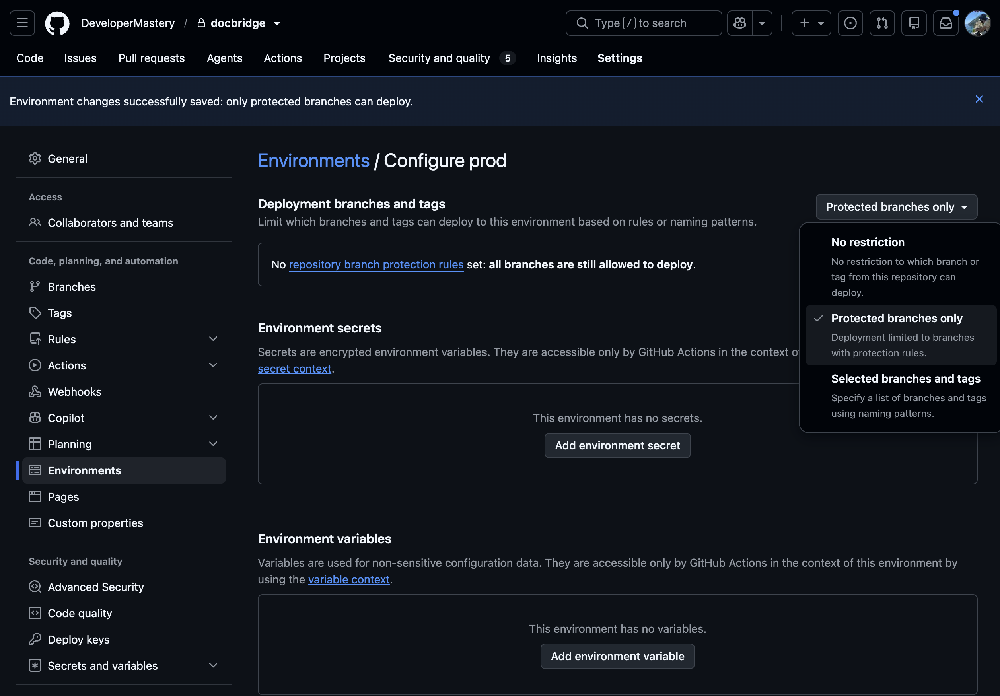

# CI/CD

Workflows live in [.github/workflows/](../.github/workflows/).

**First time:** after [SETUP.md](SETUP.md) A1–A3 (AWS CLI, state bucket, OIDC
role), complete the two sections below — repository variables and environments.
Then use the rest of this page as the pipeline reference.

## Repository variables

Settings → Secrets and variables → Actions → **Variables**:

| Variable | Set to | Purpose |
| :-- | :-- | :-- |
| `AWS_REGION` | `us-east-1` | Region for AWS CLI / Terraform |
| `AWS_DEPLOY_ROLE_ARN` | `arn:aws:iam::<ACCOUNT_ID>:role/docbridge-github-deploy` | IAM role CI assumes via OIDC |
| `TF_STATE_BUCKET` | `docbridge-tfstate-<ACCOUNT_ID>` | State bucket from bootstrap (must match `backend.hcl`) |
| `ECS_DEPLOY_ENABLED` | leave unset until M1; then `true` | ECS redeploy on push to `main` |
| `LAMBDA_DEPLOY_ENABLED` | leave unset until M2/M3; then `true` | Lambda update on push to `main` |

`<ACCOUNT_ID>` = `aws sts get-caller-identity --query Account --output text`.

## Environments

Settings → Environments: create **`dev`** and **`prod`**.

`prod` should be set from a protected branch (manual approval gate).

## When workflows run

| Workflow | Triggers | Path filter |
| :-- | :-- | :-- |
| `gitleaks` | Every PR; every push to `main` | none |
| `service-auth` | PR; push to `main` | `services/auth/**`, `packages/shared/**`, root lockfiles, its workflow files |
| `service-platform` | same | `services/platform/**` + shared/lockfiles/workflows |
| `service-docbridge-api` | same | `services/docbridge-api/**` + shared/lockfiles/workflows |
| `workers` | same | `workers/**` + shared/lockfiles/workflows |
| `infra` | same | `infra/**` + its workflow file |

Changing `packages/shared/**` starts all three service workflows and workers.
Changing only `services/auth/**` starts auth (+ gitleaks). Docs-only changes
usually start only gitleaks.

## What each pipeline does

### Services (`_service.yml`, called by each `service-*.yml`)

1. **check** — `npm ci`, lint, typecheck/test shared + that service
2. **build-push** — only on `main`: build Docker image, push to ECR as `docbridge/<service>:<git-sha>`
3. **deploy-dev** — only on `main` and if `ECS_DEPLOY_ENABLED=true`: force new ECS deployment

PRs stop after **check**.

### Workers (`workers.yml`)

1. **check** — lint, typecheck, test all three workers, esbuild bundles
2. **deploy-dev** — only on `main` and if `LAMBDA_DEPLOY_ENABLED=true`: zip + `update-function-code`

### Infra (`infra.yml`)

1. **validate** — `terraform fmt -check`, validate global/dev/prod
2. **plan** — PRs only: plan `dev`, comment on the PR
3. **apply-dev** — push to `main` only: apply global (ECR) then `dev`
4. **apply-prod** — after apply-dev; needs `prod` environment approval

### Gitleaks

Scans the repo for committed secrets. Fail = leak found.
