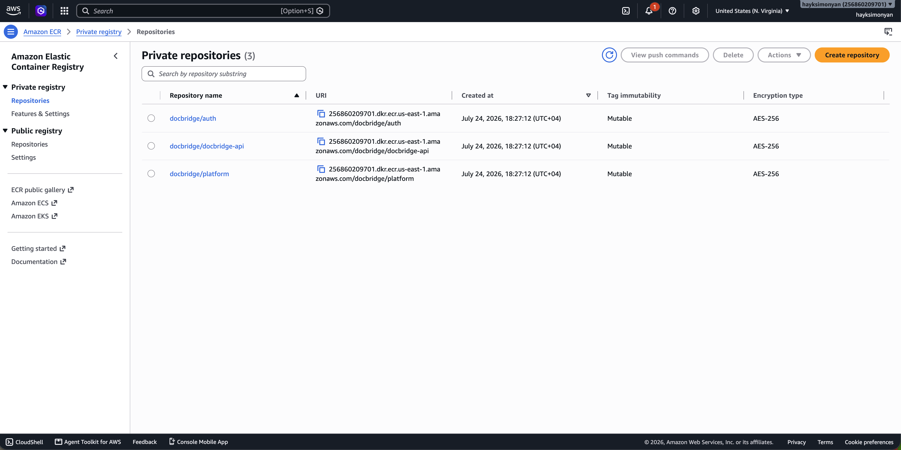
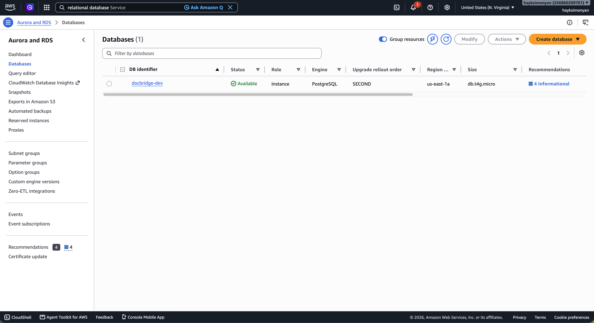
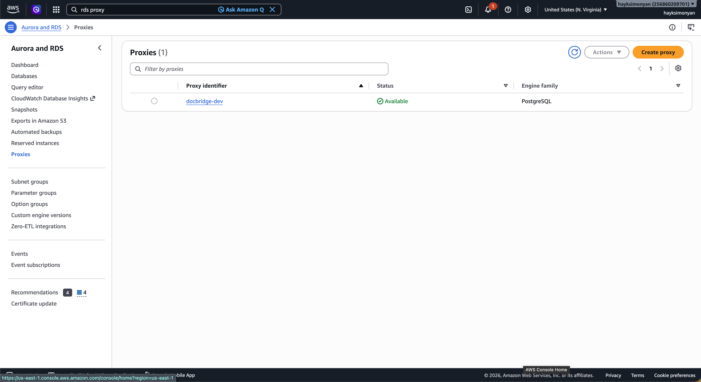
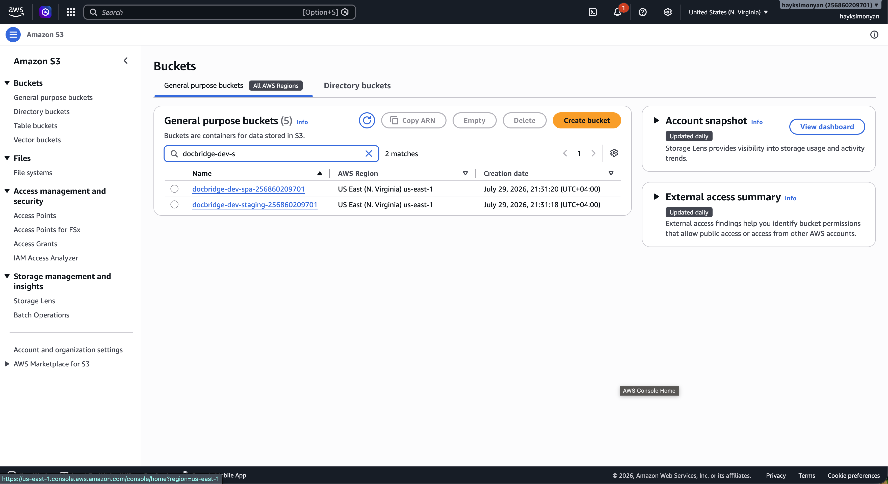
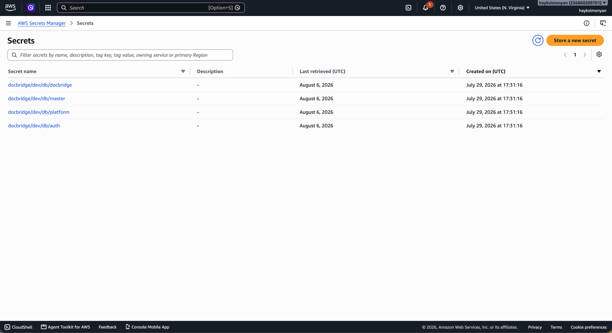
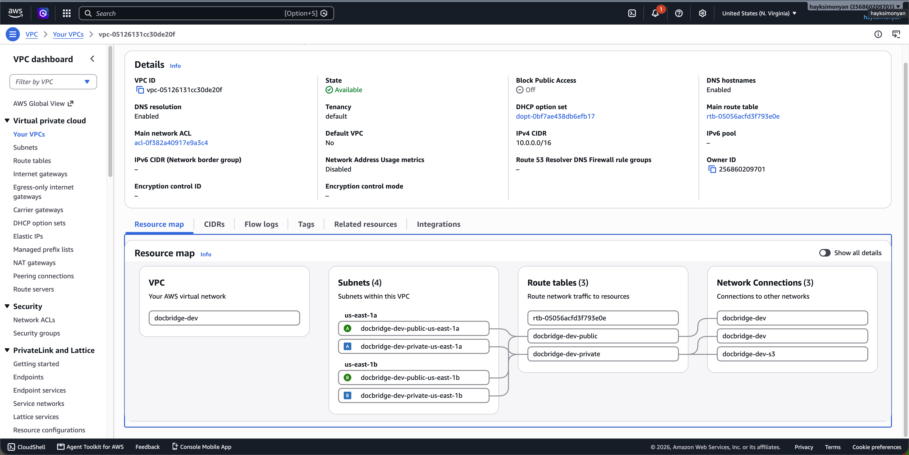

# Setup

Path for a new joiner. Do **Part A** once per AWS account / GitHub repo (usually
one person). Then use **Part B** (local) and **Part C** (dev up/down).

Prereqs on your machine: Node ≥22, Docker (local), AWS CLI + Terraform ≥1.15.8
(AWS). Region: `us-east-1`.

---

## Part A — First-time (once)

### A1. AWS credentials on your laptop

Follow [AWS_SETUP.md](AWS_SETUP.md) until `aws sts get-caller-identity` works.

### A2. Terraform state bucket

```bash
./bootstrap/create-state-backend.sh
```

Copy the printed values into a `backend.hcl` next to each example (only `key`
differs per env):

- [infra/envs/global/backend.hcl.example](../infra/envs/global/backend.hcl.example)
- [infra/envs/dev/backend.hcl.example](../infra/envs/dev/backend.hcl.example)
- [infra/envs/prod/backend.hcl.example](../infra/envs/prod/backend.hcl.example)

No secrets in these files — committing them is fine.

### A3. GitHub → AWS role (OIDC, no long-lived keys in CI)

Replace `<ACCOUNT_ID>` and `<GITHUB_ORG>/<REPO>`. Newer repos also emit
**immutable** subject claims with numeric IDs (`ORG@id/REPO@id`). Include both
patterns so CI works either way:

```bash
aws iam create-open-id-connect-provider \
  --url https://token.actions.githubusercontent.com \
  --client-id-list sts.amazonaws.com

# Optional: discover immutable IDs from a failed CI attempt in CloudTrail, or:
#   curl -s https://api.github.com/repos/<GITHUB_ORG>/<REPO> | jq '{org:.owner.id, repo:.id}'
ORG_ID=<ORG_ID>   # e.g. 171709052 for DeveloperMastery
REPO_ID=<REPO_ID> # e.g. 1311058779 for docbridge

cat > /tmp/trust.json <<EOF
{
  "Version": "2012-10-17",
  "Statement": [{
    "Effect": "Allow",
    "Principal": { "Federated": "arn:aws:iam::<ACCOUNT_ID>:oidc-provider/token.actions.githubusercontent.com" },
    "Action": "sts:AssumeRoleWithWebIdentity",
    "Condition": {
      "StringEquals": { "token.actions.githubusercontent.com:aud": "sts.amazonaws.com" },
      "StringLike": {
        "token.actions.githubusercontent.com:sub": [
          "repo:<GITHUB_ORG>/<REPO>:*",
          "repo:<GITHUB_ORG>@${ORG_ID}/<REPO>@${REPO_ID}:*"
        ]
      }
    }
  }]
}
EOF

aws iam create-role --role-name docbridge-github-deploy \
  --assume-role-policy-document file:///tmp/trust.json

# M0: broad on purpose; tighten before prod
aws iam attach-role-policy --role-name docbridge-github-deploy \
  --policy-arn arn:aws:iam::aws:policy/AdministratorAccess
```

If the role already exists and CI fails with `Not authorized to perform
sts:AssumeRoleWithWebIdentity`, update the trust policy (same document) with:

```bash
aws iam update-assume-role-policy --role-name docbridge-github-deploy \
  --policy-document file:///tmp/trust.json
```

Account id: `aws sts get-caller-identity --query Account --output text`.

Jobs that use a GitHub **Environment** (`environment: dev`) get a subject like
`...:environment:dev` — the trailing `:*` covers that.

### A4. GitHub repository wiring

Do this once in [CI_CD.md](CI_CD.md) (repository variables + `dev`/`prod`
environments). Use the role ARN from A3 and the state bucket name from A2.

---

## Part B — Local (any time)

```bash
cp .env.example .env   # first time only; defaults are fine
npm ci
docker compose up --build -d
./scripts/smoke-local.sh
```

Smoke must PASS for: three services `/health` + `/health/ready`, DB isolation
(auth cannot reach platform), LocalStack staging bucket + job/task queues with
DLQs.

Tear down: `docker compose down` (add `-v` to wipe Postgres).

---

## Part C — Dev on AWS (day to day)

### C1. Bring the environment up

```bash
./scripts/aws-up.sh     # global (ECR) + dev (~10–30 min)
```

### C2. Confirm it is up

| Check | Expect |
| :-- | :-- |
| ECR | `docbridge/auth`, `docbridge/platform`, `docbridge/docbridge-api` |
| RDS `docbridge-dev` | available, private, encrypted, Postgres 17.x |
| RDS Proxy `docbridge-dev` | available, TLS required; target health `AVAILABLE` |
| S3 | `docbridge-dev-staging-<acct>`, `docbridge-dev-spa-<acct>` |
| CloudFront | SPA distribution (403 until M1 is normal) |
| Secrets | `docbridge/dev/db/{master,auth,platform,docbridge}` |
| VPC | `docbridge-dev`, 2 public + 2 private subnets, 1 NAT |

What it looks like in the console (`us-east-1`):

**ECR** — three private repos:



**RDS** — instance `docbridge-dev` Available:



**RDS Proxy** — `docbridge-dev` Available (also open it and check target health):



**S3** — staging + spa buckets:



**Secrets Manager** — four `docbridge/dev/db/...` secrets:



**VPC** — `docbridge-dev`, 2 public + 2 private subnets:



```bash
cd infra/envs/dev
terraform plan -input=false    # No changes
terraform output
```

Full CLI checklist: [testing/M0-VALIDATION.md](testing/M0-VALIDATION.md) Phase 3.

### C3. Trigger CI / deploy from GitHub

After A3–A4 are done:

- Push or merge a change under `infra/**` to `main` → `infra` workflow applies
  global + **dev**.
- A PR that touches `infra/**` → plan only (comment on the PR).
- Service / worker path changes run their check (and on `main`, image push).
  ECS/Lambda redeploy stays off until the enable flags in A4.

Watch runs:

```bash
gh run list --branch main --limit 10
```

### C4. Tear down (stop the bill)

```bash
./scripts/aws-down.sh          # type: destroy  (~5–15 min)
# optional: ./scripts/aws-down.sh --all   # also destroy ECR repos
```

After destroy, billable pieces (NAT, RDS, proxy, VPC, CloudFront) should be
gone. What may remain (cheap): state bucket, empty ECR repos.

Bring it back later with `./scripts/aws-up.sh`.
